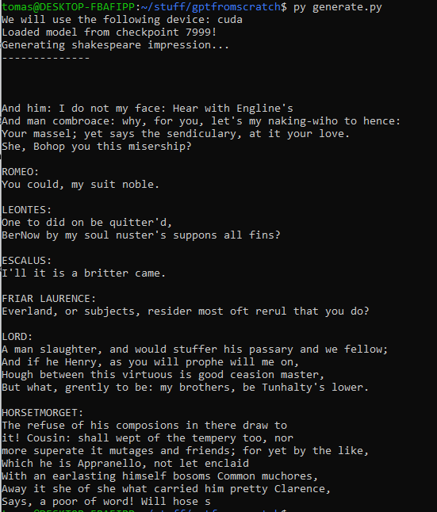
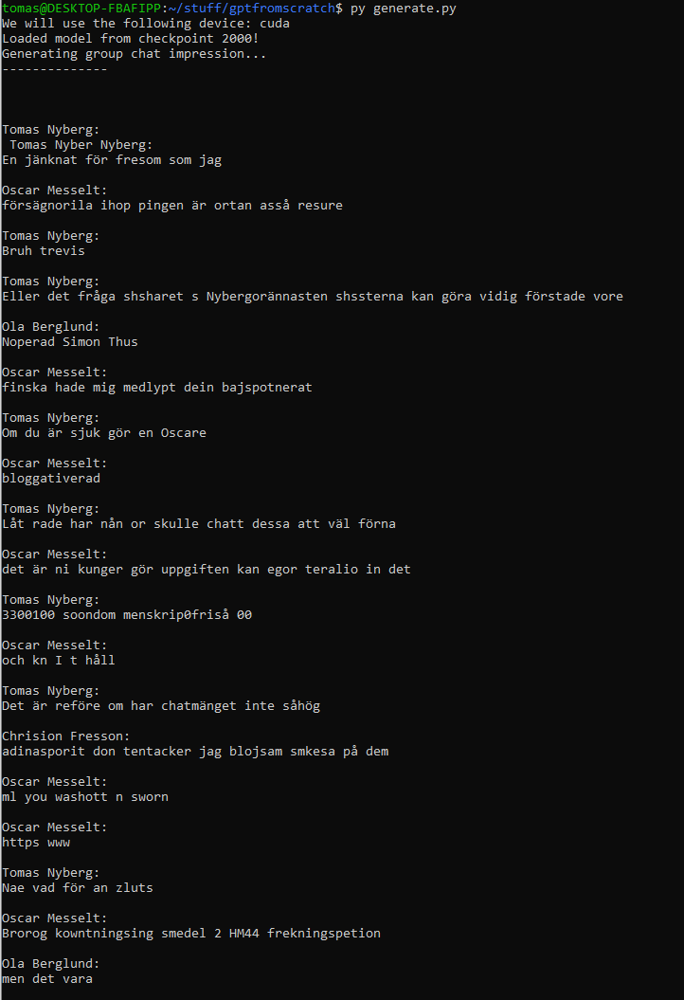

# GPT from scratch
A small repo wherein I experimented a bit with LLMs (GPT, more specifically). The contents are fairly heavily inspired by Andrej Karpathy's lectures on youtube, but adapted for the specific use cases I wanted to try it out on.

## Contents

### Language model
`model.py` - The transformer architecture

`train.py` - Training loop

`generate.py` - Inference logic

### Tokenizer
`tokenizer.py` - An implementation of the Byte-Pair Encoding (BPE) algorithm

### Extra
`convert_fb_chat.py` - Script for converting Facebook Messenger chat logs into a more digestible format.

## Results
I trained the model on both the collected works of shakespeare, as well as on the complete chat history of one of my group chats. Some sample outputs (from generate.py) can be seen below:

### Shakespeare

### Group chat
